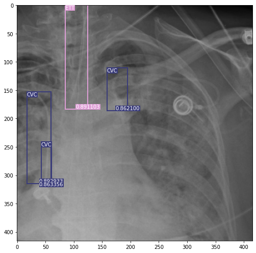
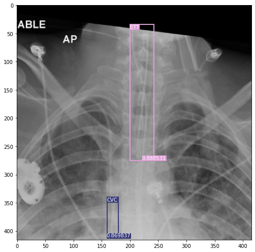

_* this project is still under study and therefore may lack information_

_** you can scroll down to skip the description and see some results_

### Catheters and Lines Detection in Chest Radiographs using Yolo-v3 and Densenet121

Yonatan Jenudi, MD [linkedin](linkedin.com/in/yjenudi)

**Abstract**

This paper summarizes the use of YOLO-v3 and Densenet121 for object detection and classification of catheters and line positions in chest radiographs.

**Introduction**

The first step in interpreting a patient's radiograph in the ICU (Intensive Care Unit) is evaluating indwelling catheters and tubes. Misplaced catheters can result in serious complications. Tube or catheter misplacement occurs in about 10% of cases. (1)

The gold standard for the confirmation of line and tube positions is chest radiographs (chest x-ray). However, a physician or radiologist must manually check these chest x-rays to verify that the lines and tubes are in the optimal position. Not only does this leave room for human error, but delays are also common as radiologists can be busy reporting other scans. Deep learning algorithms may be able to detect malpositioned catheters and lines automatically. Once alerted, clinicians can reposition or remove them to avoid life-threatening complications. (2)

#### Main Concepts

**Artificial Airways**

Positive pressure ventilation is delivered through various plastic tubes that are passed into the trachea through the vocal cords (endotracheal tubes) or are inserted directly into the trachea (tracheostomy tubes).(3).

**Endotracheal Tubes (ETT)**

Mechanical ventilators require the use of an endotracheal tube. The tube's tip should be positioned several centimeters above the tracheal carina (the lower end of the trachea). The carina may be assumed to be near the level of the aortic arch's undersurface (Fig. 1, the figure was taken from (1)) or the level of the T4-T5 vertebral bodies. (1)

Typically, the tube's tip should lie approximately 4 to 7 cm above the carina (Fig. 2, the figure was taken from (1)).

Placing an endotracheal tube too low usually results in its entering the right main bronchus. This position can produce right lung overinflation, alveolar rupture, and pneumothorax (a collapsed lung), or right upper lobe or left lung collapse because of lack of ventilation of these areas. Intubation of the left main bronchus is less common because of its more horizontal orientation.

A tube placed too high may lodge in the hypopharynx or larynx, resulting in poor ventilation or gastric distention. If the tube tip or cuff lies at the vocal cords' level, ulceration and scarring may lead to stricture.

**Tracheostomy Tubes**

A tracheostomy tube is placed if a patient requires chronic mechanical ventilation or for upper airway obstruction. The tube tip position relative to the carina is not critical because the tracheostomy stoma location determines this. 

**Central Vein Catheter (CVC)**

Central venous catheters used to measure central venous pressure or for intravenous infusion of fluids are often placed through percutaneous puncture of the internal jugular or subclavian veins. A catheter placed adequately should be in the superior vena cava (SVC). On chest radiographs, the first anterior intercostal space is the approximate site of the junction of the brachiocephalic veins (BCV) to form the SVC. Because many catheters have two or three lumens, each with a different orifice, the catheter tip should be as near to the azygos arch as possible (Fig. 3, the figure was taken from (1)).

**YOLO-v3**

YOLO (you only look once) is a family of object detection networks developed by Joseph Redmon. The YOLO family is designed for fast object detection, and it was among the first attempts to build a fast real-time object detector. It is one of the quicker object detection algorithms. YOLO makes the predictions over a limited number of bounding boxes by splitting the input into a grid of cells; each cell directly predicts a bounding box and object classification. A result is a large number of candidate bounding boxes that are consolidated into a final prediction using NMS (non-maximum suppression). (4)

**First Results**

